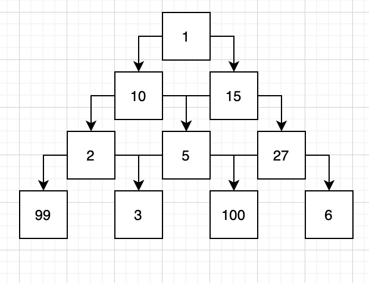
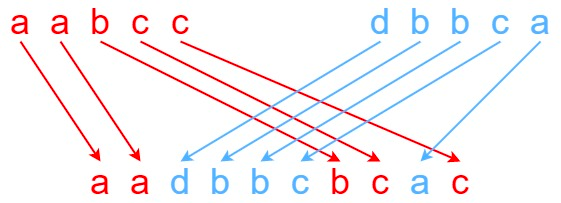

1. на вход дается 3 строки. нужно определить можно ли получить из первых двух третью, путем чередования первых двух строк.

- Пример:

```
s = s1 + s2 + ... + sn - первая строка
t = t1 + t2 + ... + tm - вторая строка
|n - m| <= 1
чередование -  s1 + t1 + s2 + t2 + s3 + t3 + ... или t1 + s1 + t2 + s2 + t3 + s3 + ...

s1 = "aabcc", s2 = "dbbca", s3 = "aadbbbaccc" -> false
s1 = "aabcc", s2 = "dbbca", s3 = "aadbbcbcac" -> true
```

2. дана пирамида в нодах которой стоят рандомные числа. спускаясь вниз по пирамиде можно только в смежные ноды - т.е из корня можно спустится на любую ноду со второго уровня, но с ноды второго уровня (10) только в 2 смежные (2 и 5), в третью нельзя (в 27). в процессе спуска мы получаем из чисел посещенных нод их сумму. найти максимально возможную сумму.

3. дан целочисленный массив nums. С этим массивом в игру играют два игрока: игрок 1 и игрок 2.
   Игрок 1 и игрок 2 по очереди, игрок 1 начинает первым. Оба игрока начинают игру со счетом 0. На каждом ходу игрок берет одно из чисел с любого конца массива (т.е. nums [0] или nums [nums.length - 1]), что уменьшает размер массив на 1. Игрок добавляет выбранное число к своему счету. Игра заканчивается, когда в массиве больше нет элементов.
   Верните true, если Игрок 1 может выиграть игру. Если очки обоих игроков равны, то игрок 1 по-прежнему остается победителем, и вы также должны вернуть true. Вы можете предположить, что оба игрока играют оптимально.

```
[1,5,2] -> false первый берет или 1 или 2, второй полюбому берет 5 и это больше чем 1+2ю так что второй выиграет
[1,5,233,7] -> true  первый берет 1, второй либо 5 либо 7, и первый берет 233, что обеспечивает ему победу
```

---

все задачи должны решаться за разумное время.

 

| List of Tasks                                                                                                       |                                                            Tests                                                             | Stage |
| ------------------------------------------------------------------------------------------------------------------- | :--------------------------------------------------------------------------------------------------------------------------: | :---: |
| [Task 1](https://github.com/ripdotnet/GlobantAlgo/blob/main/src/GlobantAlgo/09.08/ThreeLinesOfString/MergeLines.cs) |    [Tests Task 1](https://github.com/ripdotnet/GlobantAlgo/blob/main/src/GlobantAlgo/09.08/09.08.Tests/MergeLinesTest.cs)    |  ✅   |
| [Task 2](https://github.com/ripdotnet/GlobantAlgo/blob/main/src/GlobantAlgo/09.08/PyramidAndNodes/Program.cs#L15)   | [Tests Task 2](https://github.com/ripdotnet/GlobantAlgo/blob/main/src/GlobantAlgo/09.08/09.08.Tests/MaxPathInPyramidTest.cs) |  ✅   |
| [Task 3 ]()                                                                                                         |                                                                                                                              |  🌀   |

#### <i>Legend:</i>

<ul>
<li>✅ - ОК
<li>⚠️ - problem
<li>🆘 - need help
<li>🌀 - in process
</ul>
